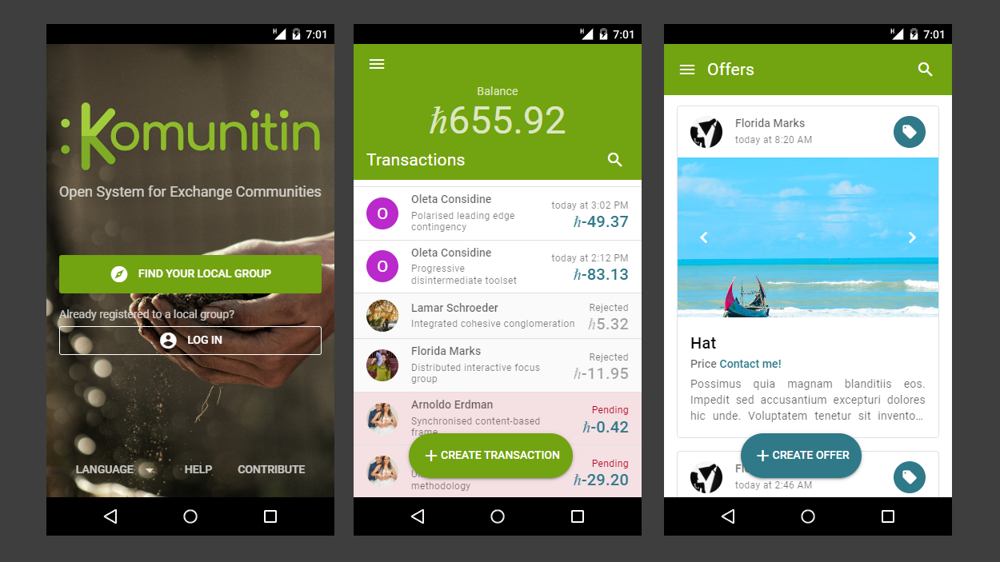

# Overview

Komunitin is an app featuring a **local community currency wallet** and a **marketplace** allowing these local communities to easily trade between themselves and other communities. It effectively facilitates trade between a **decentralized set of local community currencies**.

**Community currencies**, also referred to as [local currencies](https://en.wikipedia.org/wiki/Local\_currency) or local exchange trade systems ([LETS](https://en.wikipedia.org/wiki/Local\_exchange\_trading\_system)), are a tool for financial inclusion that allows for a transition to a fairer and more ecologically sustainable economy. They are issued and governed by mutual credit groups, cooperatives, time banks, local councils, etc. These groups define the currency rules and deploy local monetary policies, yet they need more features than just a payments system: providing a marketplace for buyers and sellers, publishing community news, facilitating communication between members, etc.

Different **state-of-the-art technologies** are used to accomplish the project mission, including the Stellar blockchain, the TypeScript and Go programming languages, PostgreSQL and Redis databases, Docker containers for a scalable microservice architecure and push messages for real-time notifications.

Komunitin is an **open source** project developed without profit and sustented by the user community.

<figure><figcaption>
Login, transfers and offers screens of the Komunitin app on mobile
</figcaption></figure>
